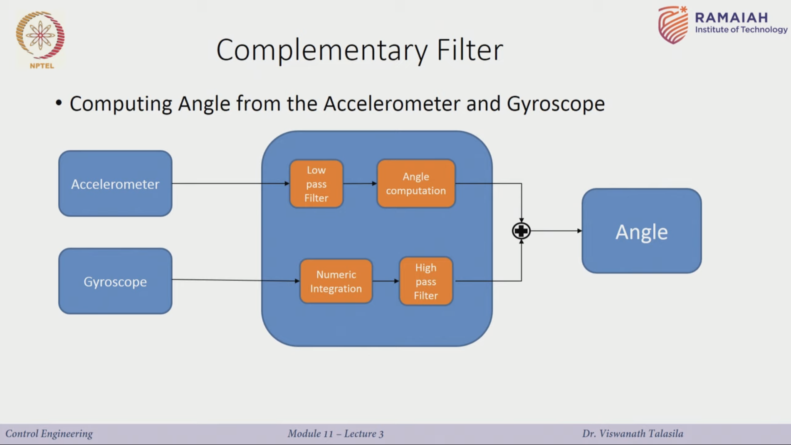
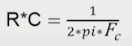
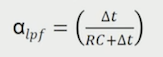
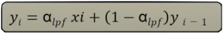
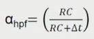
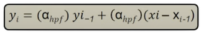
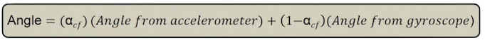

# Complementary Filter for Inertial State Estimation

** This folder contains IMU processing work related to A1 **

## Introduction

A complementary filter is used to combine slow mowing signals from the accelerometer and fast moving signlas from the gyroscope and combine them. The accelerometer data is passed through a low-pass filter, while the gyroscope data is passed through a high-pass filter. The code was structured following this lecture [Complementary Filter by Control Engineering](https://www.youtube.com/watch?v=xg7zO8wiP1I&list=WL&index=4&t=0s).



<br>

## 1. Parsing IMU data from CSV file

The csv file containing the A1 IMU data is parsed to extract important and needed information in desired format.

```python
def get_gyroscope_data(self):
    gyroscope_data = []
    for data in self.imu_data_frame['.imu.gyroscope']:
        entry = eval(data)
        gyroscope_data.append(entry)  
    return gyroscope_data  

def get_accelerometer_data(self):
    accelerometer_data = []
    for data in self.imu_data_frame['.imu.accelerometer']:
        entry = eval(data)
        accelerometer_data.append(entry)  
    return accelerometer_data
```

The data is contained within a csv file (e.g. [walkfrontandback10mlcm_high_state_data.csv](/walkfrontandback10mlcm_high_state_data.csv)), therefore it needs to be parsed into usable data structures. The parsing is done in [process_imu.py](/parse_imu/process_imu.py).

<br>

## 2. Low-pass filter

A low-pass filter is used to filter out frequencies above a desired frequency and only allow frequencies below
a cutoff. This filter will be applied on the acceleretion data.

The required values are:

1. The RC value is first calculated as:



2. The filter constant is calculated as:



The filter calculation is done as follows where *x* is the acceleration data point, while *y* is the filtered data point:



```python
def low_pass(self, accel_values, delta_t, accel_lp_previous, cutoff_frequency):
        r_c = 1 / (2 * math.pi * cutoff_frequency)
        filter_const = delta_t / (r_c + delta_t)

        accel_x = filter_const * \
            accel_values[0] + (1 - filter_const) * accel_lp_previous[0]
        accel_y = filter_const * \
            accel_values[1] + (1 - filter_const) * accel_lp_previous[1]
        accel_z = filter_const * \
            accel_values[2] + (1 - filter_const) * accel_lp_previous[2]

        return (accel_x, accel_y, accel_z)
``` 
For detailed parameter description, check [complementary_filter.py](/parse_imu/complementary_filter.py)

<br>

## 3. Computing Accelerometer Angles

The accelerometer angles need to be derived from the low-pass filtered accelerometer data.

Tha angles can be derived using:


The angles are then converted and returned as quartenions.

```python
def compute_accel_angle(self, accel_values):
        # Tokenize data
        accelx_lp = accel_values[0]
        accely_lp = accel_values[1]
        accelz_lp = accel_values[2]

        # Compute the accel angle
        x = math.sqrt((accely_lp * accely_lp) + (accelz_lp * accelz_lp))
        angle_x = math.atan(accelx_lp / x)

        y = math.sqrt((accelx_lp * accelx_lp) + (accelz_lp * accelz_lp))
        angle_y = math.atan(accely_lp / y)

        z = math.sqrt((accelx_lp * accelx_lp) + (accely_lp * accely_lp))
        angle_z = math.atan(z / accelz_lp)

        # Convert euler to quternion format.
        return self.euler_to_quaternion(angle_x, angle_y, angle_z)
``` 
For detailed parameter description, check [complementary_filter.py](/parse_imu/complementary_filter.py)

<br>

## 4. Numeric Integration

[algorithm]

```python
def numeric_integrate_gyro(self, gyroscope_data, delta_t, estimated_quaternion):

        # Calculate the magnitude of the gyro measurement and multiply by the time differential.
        omega_x = gyroscope_data[0]
        omega_y = gyroscope_data[1]
        omega_z = gyroscope_data[2]

        omega_mag = math.sqrt(omega_x**2 + omega_y**2 + omega_z**2)
        theta = omega_mag * delta_t

        if(omega_mag != 0):
            normalize_vx = omega_x / omega_mag
            normalize_vy = omega_y / omega_mag
            normalize_vz = omega_z / omega_mag

            normalize_vector = (normalize_vx, normalize_vy, normalize_vz)

            # Q.update = (cos(theta/2),v_x * sin(theta/2), v_y * sin(theta/2), v_z * sin(theta/2));
            quaternion_update = (math.cos((theta)/2), normalize_vx * math.sin(
                theta/2), normalize_vy * math.sin(theta/2), normalize_vz * math.sin(theta/2))
            estimated_quaternion = self.quaternion_multiply(
                quaternion_update, estimated_quaternion)

        return estimated_quaternion
``` 

For detailed parameter description, check [complementary_filter.py](/parse_imu/complementary_filter.py)

<br>

## 5. High-pass filter

A high-pass filter is used to filter out frequencies below a desired frequency and only allow frequencies above
a cutoff. This filter will be applied on the gyroscopic data after the numeric integration.

The required values are:

1. The RC value is first calculated as:


2. The filter constant is calculated as:



The filter calculation is done as follows where *x* is the acceleration data point, while *y* is the filtered data point:



```python
def high_pass(self, quaternions, quaternions_previous, delta_t, gyro_hp_previous, cutoff_frequency):
        r_c = 1 / (2 * math.pi * cutoff_frequency)
        filter_const = r_c / (r_c + delta_t)
        gyro_angle_q1 = filter_const * \
            gyro_hp_previous[0] + filter_const * \
            (quaternions[0] - quaternions_previous[0])

        gyro_angle_q2 = filter_const * \
            gyro_hp_previous[1] + filter_const * \
            (quaternions[1] - quaternions_previous[1])

        gyro_angle_q3 = filter_const * \
            gyro_hp_previous[2] + filter_const * \
            (quaternions[2] - quaternions_previous[2])

        gyro_angle_q4 = filter_const * \
            gyro_hp_previous[3] + filter_const * \
            (quaternions[3] - quaternions_previous[3])

        return (gyro_angle_q1, gyro_angle_q2, gyro_angle_q3, gyro_angle_q4)
```

For detailed parameter description, check [complementary_filter.py](/parse_imu/complementary_filter.py)

<br>

## 6. Complementary filter

With the complementary filter we combine the data from the low-pass filter with the data from the high-pass filter so that  the frequencies filtered complement each other.

The filter calculation is done as follows where *x* is the acceleration data point, while *y* is the filtered data point:



```python
def complementary_filter(self, filter_const, accel_angles, gyro_highpass):
        comp_q1 = filter_const * \
            accel_angles[0] + (1 - filter_const) * gyro_highpass[0]
        comp_q2 = filter_const * \
            accel_angles[1] + (1 - filter_const) * gyro_highpass[1]
        comp_q3 = filter_const * \
            accel_angles[2] + (1 - filter_const) * gyro_highpass[2]
        comp_q4 = filter_const * \
            accel_angles[3] + (1 - filter_const) * gyro_highpass[3]
        return (comp_q1, comp_q2, comp_q3, comp_q4)
```

For detailed parameter description, check [complementary_filter.py](/parse_imu/complementary_filter.py)
